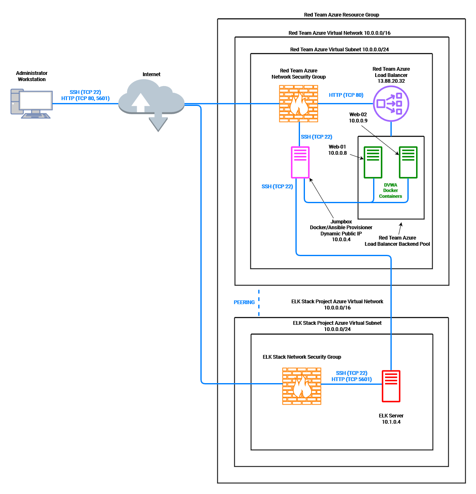
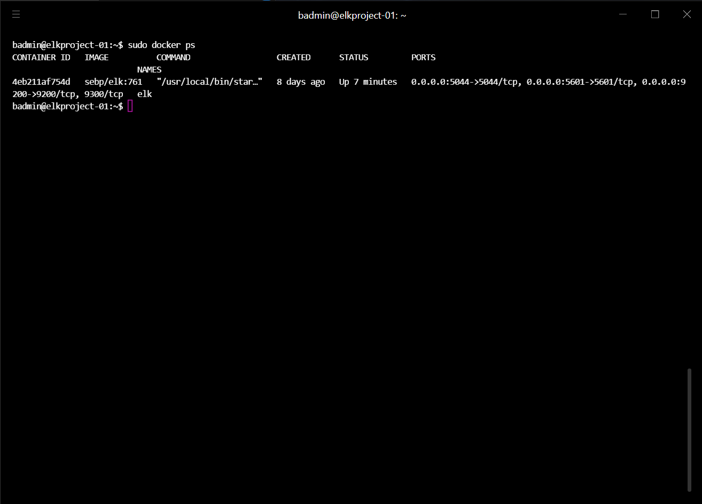

# Azure Lab: ELK Stack Deployment via Ansible Playbooks

This repository is comprised of the files that were created and used to provision the Azure resources illustrated in the following diagram:

The files can be used as-is to generate another live ELK demo in Azure, or revised and modified for modular deployment of specific components (such as Filebeat, Metricbeat, etc.).

This document contains:
- Topology Details
- Access Policies
- ELK Configuration
    - Using Beats
    - Resource Monitoring
- Ansible Build Deployment & Use Walkthrough

### Topology Details

This is a demo to illustrate a monitored system with redundancy and access restrictions that replicate standards found in production systems. In this example, a load balanced instance of DVWA (D*mn Vulnerable Web Application) is utilized. Here, the load balancer facilitates a means of negotiating security, accessibility, and redundancy interests for the resources that make up the DVWA instance.

Further restrictions on network access in Azure are also in place to assist in minimizing the surface area of network exposure. This included provisioning SSH key authentication and strict limitations on explicitly whitelisted IPs. Also, a jump box was used as the primary means of provisioning the other resources on the private network. Before continuing, ensure that these options are suitable for individual use case, and make adjustments as needed. Continue onto the access policies section for further detail on these specifications.

With the redundancy and security implementations in place, integrating an ELK server with Filebeat and Metricbeat shippers will provide visibility of changes made to files and metrics from the operating systems and services on the servers.

The below table summarizes the configuration of each virtual machine deployed:

|      NAME     |    DESCRIPTION    | PRIVATE IP |   OS  |
|:-------------:|:-----------------:|:----------:|:-----:|
|    jumpbox    |    Gateway/Host   |  10.0.0.4  | Linux |
|     web-01    | Web Server (DVWA) |  10.0.0.8  | Linux |
|     web-02    | Web Server (DVWA) |  10.0.0.9  | Linux |
| elkproject-01 |  Web Server (ELK) |  10.1.0.4  | Linux |

### Access Policies

As is visible in the topology diagram, a jump box accessible via SSH was responsible for the provisioning of other internal resources not exposed to the public for direct SSH connections. For the sake of the demo, the only inbound traffic accepted into the network originated from the administrator's public IP and was mapped to the appropriate resource by service and port. The accepted connections included:

- TCP on port 22 for SSH connections to the jumpbox
- TCP on port 80 for HTTP connections to the DVWA load balancer's public IP
- TCP on port 5601 for HTTP connections to Kibana

The SSH availability configuration for each resource is as follows:

|    RESOURCE   | PUBLIC ACCESSIBILITY |   ALLOWED ADDRESSES   |
|:-------------:|:--------------------:|:---------------------:|
|    jumpbox    |          Yes         | Admin. Public IP, LAN |
|     web-01    |          No          |        10.0.0.4       |
|     web-02    |          No          |        10.0.0.4       |
| elkproject-01 |          No          |        10.0.0.4       |

### ELK Configuration

The ELK server was configured through Ansible. Automating these elements of deployment allows for centralized configuration management. That centralization can be crucial for timely, comprehensive organization between multiple configurations that interact with each other. This ease of access can be crucial in time-sensitive arenas such as security policy remediation.

The playbook responsible for the ELK server installation and configuration completed the following tasks:

- Increased target system memory use automatically at start
- Install `apt` packages:
  - `docker.io`
  - `python3-pip`
- Download and launch ELK Docker Container
  - image used: `sebp/elk:761`
- Map default ELK ports 5044, 5601, and 9200

After the playbook is successfully completed, running `docker ps` from an SSH session with the ELK server will confirm that the container is running. Confirmation of success will result in an output with the correct container name and the three ports that were mapped.

##### Using Beats

With the ELK server up and ready to receive information, the last leg of the deployment stage is to install and configure the shippers that collect the specific information regarding file management, operating system status, and service statistics.

This ELK server is responsible for monitoring the two virtual machines that comprise the DVWA instance:

- web-01 (10.0.0.8)
- web-02 (10.0.0.9)

Filebeat will monitor the log files of the servers that it is installed on and forward them for indexing. This will include information such as login information and administrative actions attempted and/or performed. For example, the Apache module will parse access and error logs by the Apache HTTP server.

Metricbeat will collect information on system resources and their overall health. Here, a specific metricset would be Azure container_service which will allow users to retrieve all metrics from their specified container services. Plenty of metricsets are available and that list is continually growing.

In order to obtain the pertinent information from these target machines, Filebeat and Metricbeat were installed and configured similarly to how the ELK server was deployed. The primary exception was that they were deployed with individual configuration files and playbooks for each shipper. These playbooks addressed the DVWA machines as hosts from a pattern and applied specifications defined in the config files. This ensured consistency of the configuration settings; including pointing to the ELK server's IP address.

The config files used for the implementation of Beats are included, but it's advised to retrieve then modify the most up-to-date configs from the Ansible website directly.

### Using the Playbook

Use of the ELK server deployment playbook requires that the Ansible control node has already been configured. Presuming that is the case, the procedure included issuing commands via SSH to the control node for the following:

- Copying the playbook file (install-elk.yml) to the Ansible container
  `sudo nano /etc/ansible/install-elk.yml`
  include tasks that:
  increase memory
  install `docker.io` & `python3-pip`
  download ELK Docker container
  Map default ELK ports
  load settings after reboot
- Updating the Ansible hosts file to include the ELK server IP address in its own distinct host pattern in python-readable format
  `sudo nano etc/ansible/hosts`
  
  [elk]
  
  <ELK server IP> ansible_python_interpreter=/usr/bin/python3

- Actually running the playbook
  `ansible-playbook install-elk.yml`
- Navigating to `<ELK server public IP>:5601`
  This is the address and port to access the Kibana GUI
